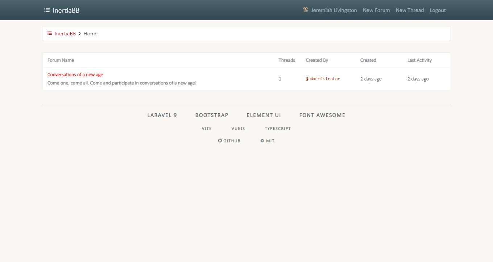

# InertiaBB
A powerful, simple, elegant Bulletin Board built on Laravel 9 and InertiaJS



## Install, Run & Optimize
- Before running the commands below, copy the `.env.example` file to `.env` and change your settings (database, app title, etc)

### Installation
```bash
# server dependencies
$ composer install
# client dependencies
$ npm install
# generate application key
$ composer key
# migrate & seed
$ composer build
# create symbolic link between assets
$ composer link
```

### Run
```bash
# client (development)
$ npm run dev
# client (production)
$ npm run build
# server (development)
$ php artisan serve
# built-in websocket server
$ php artisan websocket:serve
```

### Build
 To build a full component, including all requests, migrations, view files, 
 controllers, et al, simply use the following command:

#### An example `products` component
```bash
$ php artisan make:component Products ?backend
```

Since the above above command took no arguments, it will generate the 
following:
 - Controller:
   - `App\Http\Controllers\Backend\ProductController`
 - Requests:
   - `App\Http\Requests\Users\UpdateProductRequest`
   - `App\Http\Requests\Users\CreateProductRequest`
- Model (with soft-deletes)
  - `App\Models\Product`
- Migration (with soft-deletes)
  - `database/XXX_create_products_table.php`
- Seeder
  - `Database\Seeders\ProductSeeder`
- Factory
  - `Database\Factories\ProductFactory`
- Test
  - `Tests\Feature\ProductsPageTest`
- Views (configurable - follows Laravel's resource route nomenclature)
  - Create
    - `resources/pages/backend/products/create.vue`
  - Index
    - `resources/pages/backend/products/index.vue`
  - Edit
    - `resources/pages/backend/products/edit.vue`
  - Show
    - `resources/pages/backend/products/show.vue`

### Optimize
```bash
# clear all caches
$ composer optimize
# prettify codebase
$ npm run prettify  # vue-js (prettier)
$ composer pint     # laravel (psr-12)
```

## Accounts
### Admin:
```
username: administrator@example.com
password: administrator 
```
### Moderator:
```
username: moderator@example.com
password: moderator 
```
### Member:
```
username: member@example.com
password: member 
```

## TO-DO:
- [ ] Separate frontend `pages` into individual components (EG: thread page -> header, content, footer, likes -> counter, post form -> header, content, footer
- [ ] Establish why `threads/show` is throwing a `Cannot read properties of undefined (reading 'username')` upon page load/reload
- [ ] Change `App\Models\Post` to `App\Models\Reply` and alter application to accommodate the new `replies` table
- [ ] Add gate logic for categories/forums/threads to show soft-deleted items to administrators and moderators
- [ ] Implement `restore` logic on categories/forums/threads for administrators and moderators
- [ ] Implement `likes` system in `App\Models\Post`, and on posts frontend
- [ ] Implement post feature on threads and reply button in thread header
- [ ] Implement Category system for forums

## License
Copyright (c) 2022 Jason Napolitano

Permission is hereby granted, free of charge, to any person obtaining a copy of this software and associated
documentation files (the "Software"), to deal in the Software without restriction, including without limitation the
rights to use, copy, modify, merge, publish, distribute, sublicense, and/or sell copies of the Software, and to permit
persons to whom the Software is furnished to do so, subject to the following conditions:

The above copyright notice and this permission notice shall be included in all copies or substantial portions of the
Software.

THE SOFTWARE IS PROVIDED "AS IS", WITHOUT WARRANTY OF ANY KIND, EXPRESS OR IMPLIED, INCLUDING BUT NOT LIMITED TO THE
WARRANTIES OF MERCHANTABILITY, FITNESS FOR A PARTICULAR PURPOSE AND NONINFRINGEMENT. IN NO EVENT SHALL THE AUTHORS OR
COPYRIGHT HOLDERS BE LIABLE FOR ANY CLAIM, DAMAGES OR OTHER LIABILITY, WHETHER IN AN ACTION OF CONTRACT, TORT OR
OTHERWISE, ARISING FROM, OUT OF OR IN CONNECTION WITH THE SOFTWARE OR THE USE OR OTHER DEALINGS IN THE SOFTWARE.
